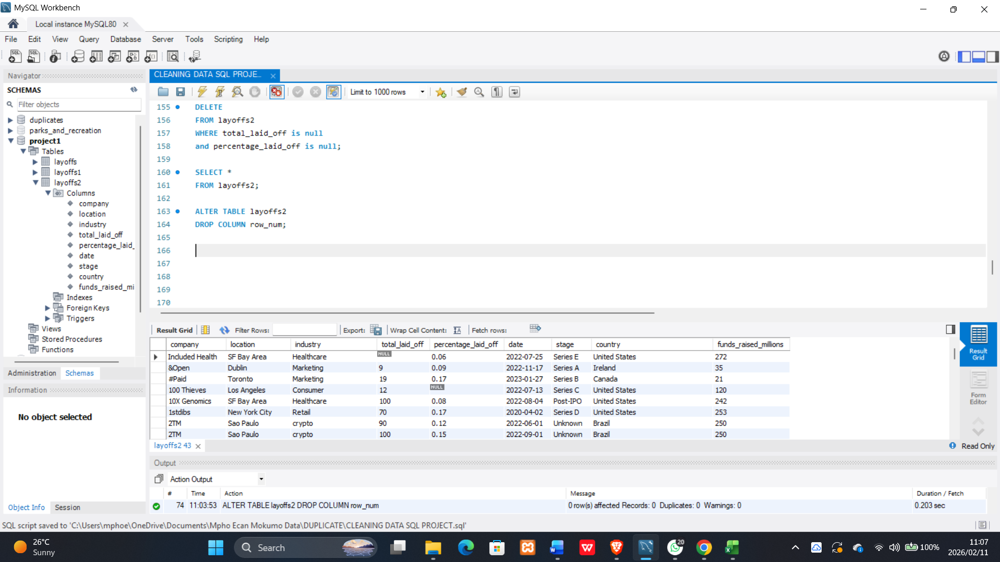

Data-Cleaning-in-MySQL (preview) 
📌 Overview
This project demonstrates practical SQL data cleaning skills used in real-world data analyst roles.
The objective was to transform raw, inconsistent layoff data into a clean, structured, and analysis-ready dataset using MySQL.

1. 🛠 Tools & Technologies
 - MySQL
 - MySQL Workbench
 - SQL (DDL, DML, CTEs, Window Functions)

2. Data Cleaning Process

 (a) Staging Tables
  - Preserved the original dataset in staging tables.
  - Ensured transformations were safe and reversible.

 (b) Duplicate Removal
  - Applied ROW_NUMBER() with PARTITION BY to identify duplicates.
  - Retained one valid record per group.

 (c) Text Standardization
  - Used TRIM() to remove spaces.
  - Standardized company, industry, and country names.

 (d) Handling Nulls & Blanks
  - Converted blanks to NULL.
  - Filled missing values logically where possible.

 (e) Date Formatting
  - Converted text dates into proper DATE data types.
  - Ensured consistency across all records.

 (f) Final Validation
  - Verified data integrity.
  - Confirmed dataset was ready for analysis and reporting.

3. 📊 SQL Concepts Applied
 - Common Table Expressions (CTEs)
 - Window Functions (ROW_NUMBER)
 - Conditional Logic (CASE)
 - String Functions (TRIM)
 - Null Handling (IS NULL)
 - Filtering with WHERE

4. ✅ Outcomes
 - Removed duplicate records.
 - Standardized text fields.
 - Corrected missing and invalid values.
 - Produced a clean dataset suitable for analysis.
